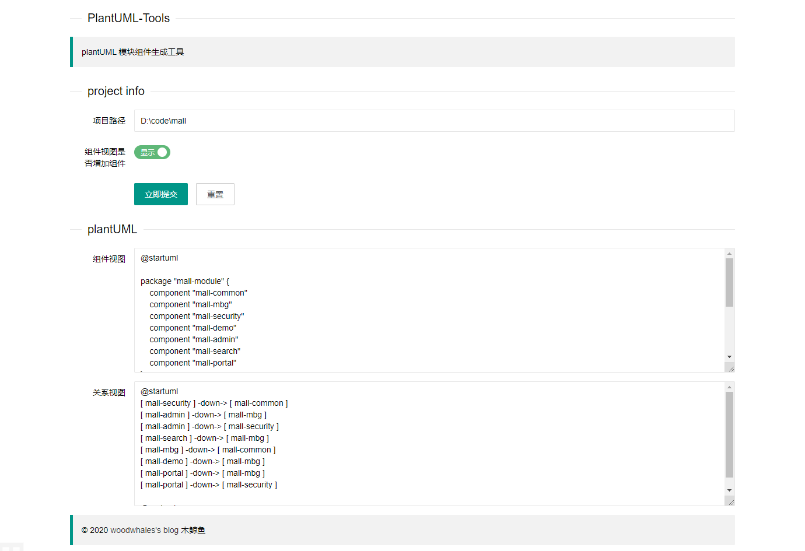
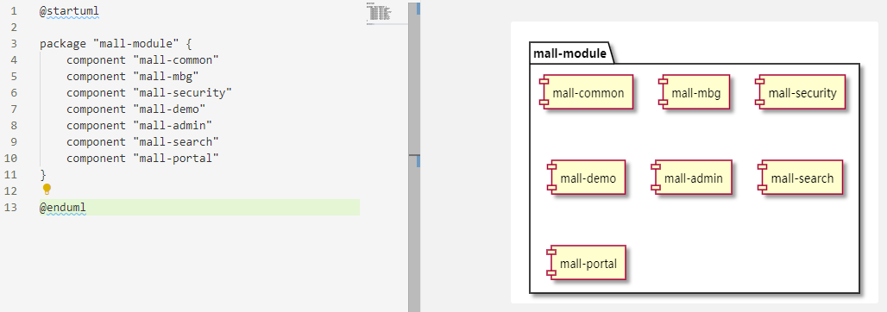
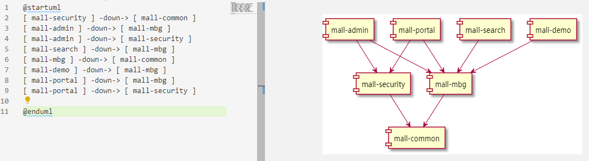

# woodwhales-PlantUML-Tools

 

根据指定 maven 工程生成组件图及模块关系视图的 plantUML 代码。

说明：plantUML 语法学习及安装，请移步至笔者的博文：[PlantUML 语法之时序图](https://woodwhales.cn/2019/01/13/017/)

> JDK 运行环境要求：JDK 1.8+
>
> 默认访问URL：http://127.0.0.1:8086/uml-tools/

指定好根项目的绝对路径，选择组件视图代码中是否需要生成组件代码（默认不开启），点击立即提交即可。

以 mall 项目为例：https://github.com/macrozheng/mall

生成效果如下：

组件视图

关系视图

